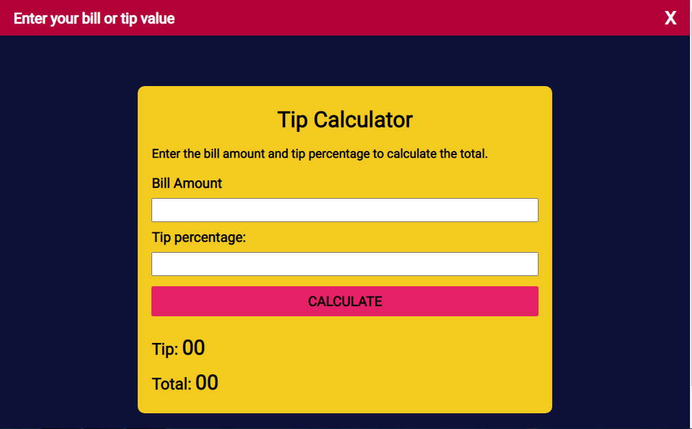

# Tip Calculator

A simple tip calculator built using HTML, CSS, and JavaScript.

## Demo

Check out the [live demo](https://muzammilop.github.io/tip-calculator/) of the tip calculator.

## Technologies Used

- HTML
- CSS
- JavaScript

## Screenshot

## How to Use

1. Enter the bill amount in the designated field.
2. Select the desired tip percentage.
3. The calculated tip amount will be displayed instantly.

Feel free to explore the live demo and calculate tips effortlessly!

## Created By:

Muzamil Ahmed Khan
